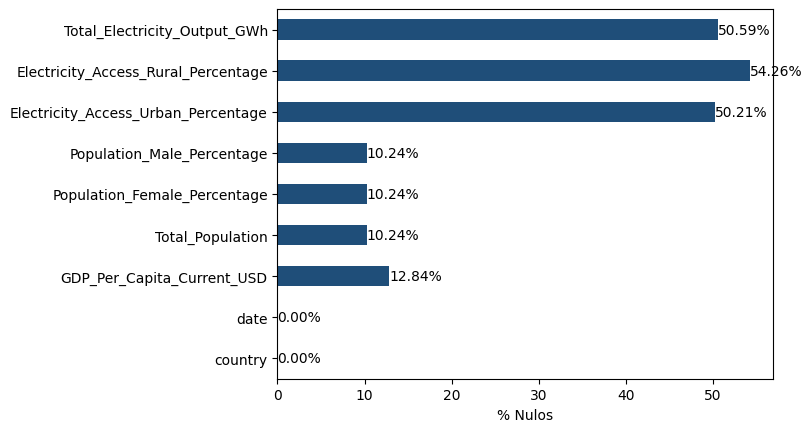
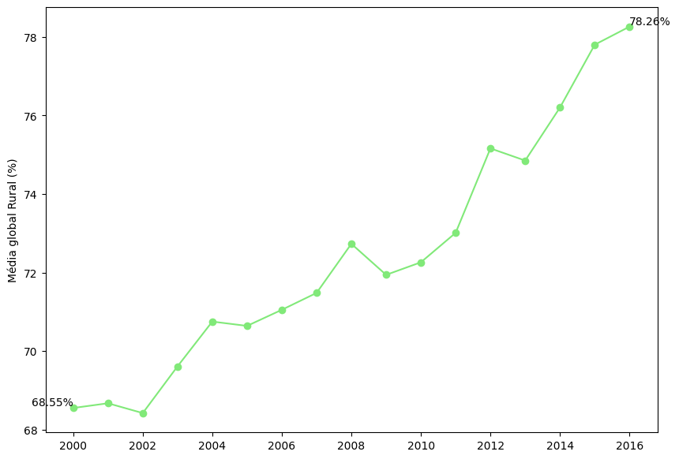
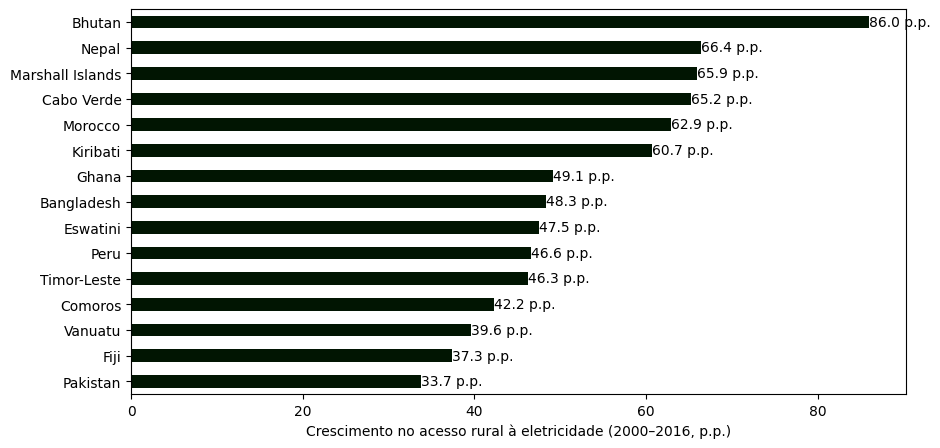
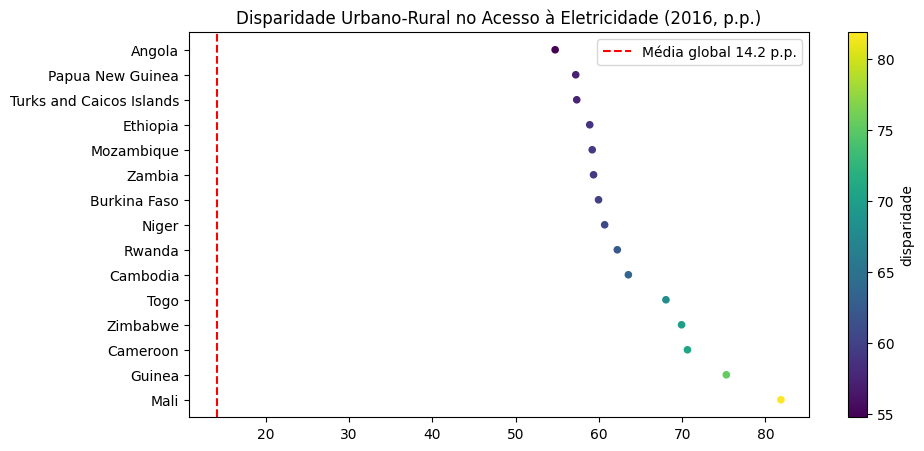
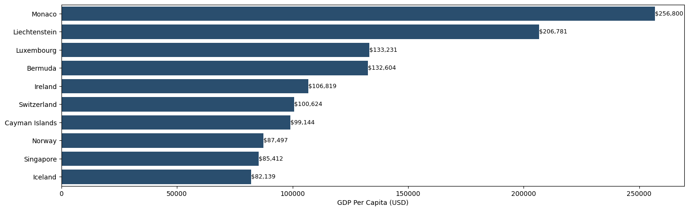
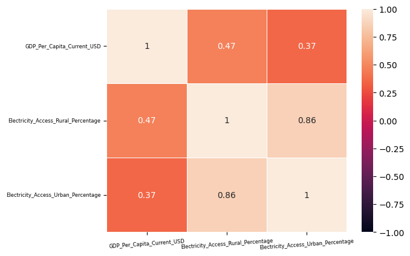
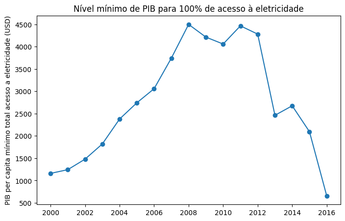
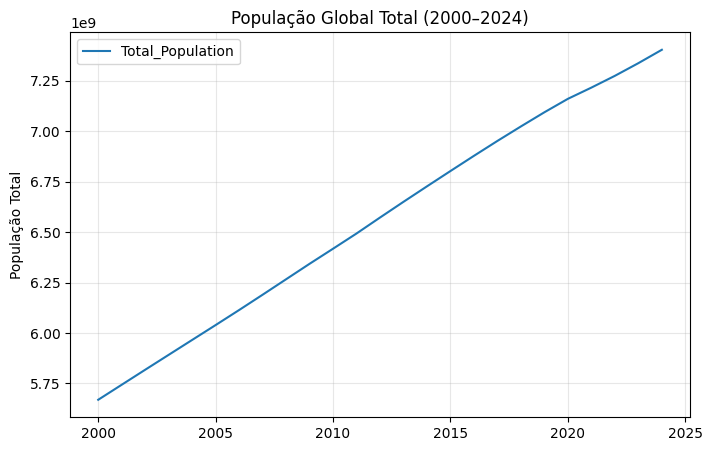
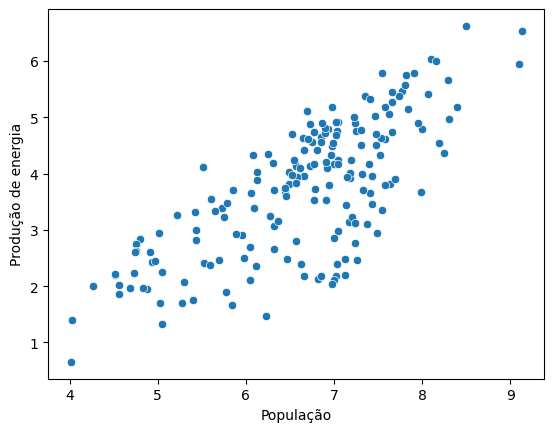
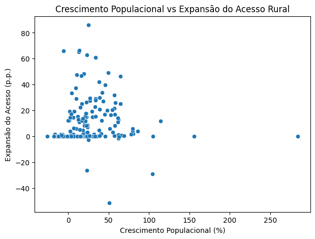

# Análise Global do Acesso à Eletricidade (2000–2024)

## Contexto

Este conjunto de dados reúne indicadores do Banco Mundial ao longo de 25 anos, permitindo analisar a relação entre desenvolvimento econômico, dinâmica populacional e acesso à eletricidade em nível global.

O objetivo desta análise é identificar padrões e desigualdades entre países.

Dataset inspirado no projeto de Muhammad Aammar Tufail, desenvolvido com abordagem própria para fins de estudo.

---

## Estrutura da Análise

- 4.880 linhas  
- 9 colunas  
- Período: 2000 a 2024  

### 🔎 Verificação de Dados

---

# 1️⃣ Panorama Global do Acesso à Eletricidade

## 1.1 - Quantos países tinham 100% de acesso em 2015?

**69 países** possuíam acesso urbano e rural universalizado em 2015.

---

## 1.2 - Qual é a tendência média global de acesso à eletricidade rural (2000–2016)?

Entre 2000 e 2016:

- 2000: 68,55%
- 2016: 78,26%
- Crescimento: +10,01 p.p.

Observa-se crescimento consistente, com aceleração após 2011.

---

## 1.3 - Quais países apresentam o crescimento mais rápido em eletricidade rural?

Destaques:

- Bhutan (+86 p.p.)
- Nepal (+66,4 p.p.)
- Marshall Islands (+65,9 p.p.)

Predominância de países africanos e do Sul da Ásia.

---

## 1.4 - Quais países têm a maior disparidade entre o acesso à eletricidade urbana e rural?

- Média global em 2016: 14,2 p.p.
- Mali, Guiné e Camarões: >50 p.p.

Ainda existem desigualdades estruturais significativas.

---

# 2️⃣ Energia e Desenvolvimento Econômico

## 2.1 - Os 10 principais países por PIB per capita em 2023?

Concentração na Europa Ocidental e centros financeiros globais.

---

## 2.2 - Existe correlação entre PIB per capita e acesso à eletricidade?

- Rural: r = 0,47 (moderada)
- Urbana: r = 0,37 (mais fraca)

Renda influencia, mas não é determinante isolada.

---

## 2.3 - Existe um nível de PIB a partir do qual o acesso tende a ser universal?

A evolução do PIB mínimo entre países com acesso universal não segue um padrão linear. No início dos anos 2000, observa-se que alguns países com renda per capita relativamente baixa já apresentavam universalização. Entre 2006 e 2012, o nível mínimo de renda entre países universalizados aumentou significativamente, concentrando-se em economias de renda média. No entanto, a partir de 2013 verifica-se nova redução desse valor, indicando que países com menor nível de renda passaram a atingir acesso universal, possivelmente impulsionados por avanços tecnológicos e políticas públicas direcionadas.

---

# 3️⃣ Demografia e Infraestrutura

## 3.1 - Como a população global mudou (2000–2024)?

- 2000: 5,7 bilhões
- 2024: 7,4 bilhões
- +1,7 bilhão no período

---

## 3.2 - Como a produção de eletricidade se relaciona com a população?

Observa-se uma correlação positiva entre população e produção de eletricidade. Países mais populosos tendem a produzir maior volume absoluto de energia. A aplicação da escala logarítmica revela um padrão aproximadamente linear, indicando uma relação estrutural consistente entre tamanho populacional e demanda energética.

---

## 3.3 - Países com crescimento populacional alto conseguem expandir acesso?

Não dá para dizer que países que crescem mais em população conseguem automaticamente expandir o acesso à eletricidade rural. Os resultados variam bastante, mostrando que o crescimento demográfico por si só não explica a evolução do acesso.

---

# Ferramentas Utilizadas

- Python
- Pandas
- NumPy
- Matplotlib
- Seaborn
- Pycountry
- Jupyter Notebook